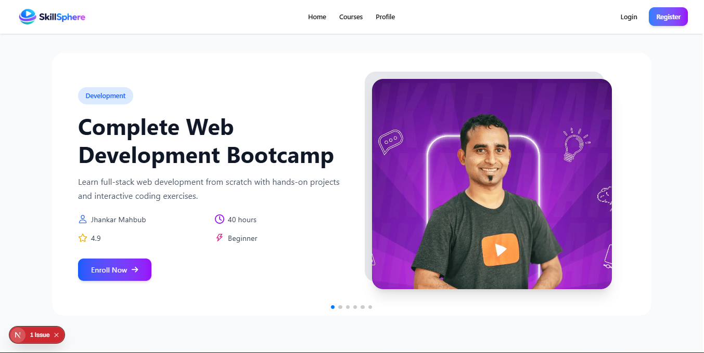
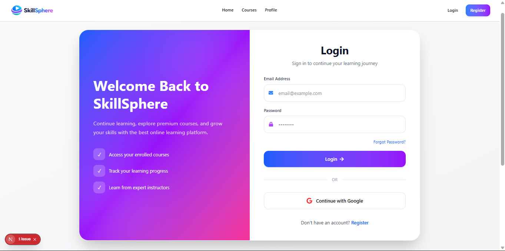
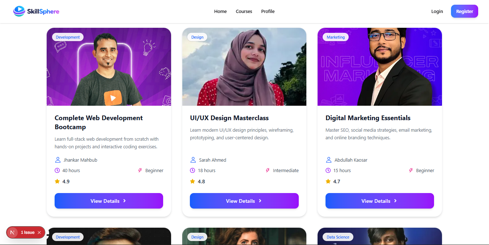
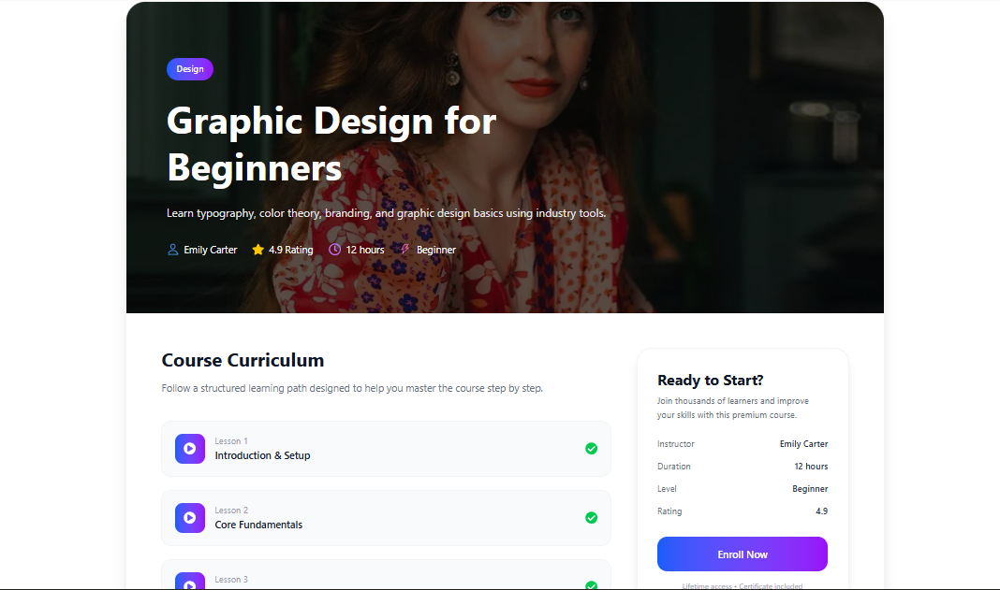
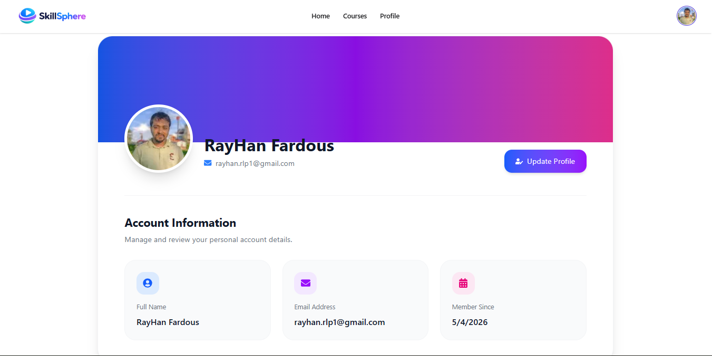

# 📚 SkillSphere – Online Learning Platform

SkillSphere is a modern full-stack web application designed to provide users with a seamless online learning experience. Users can explore courses, watch lessons, and enroll in skill-based programs such as Web Development, Design, Marketing, and more.

---

## 🚀 Live Demo
🔗 https://skill-sphere-edu.vercel.app

---

## ✨ Features

- 🔐 Authentication system (Login/Register)
- 📚 Browse and explore courses
- 👤 User profile management
- 🔔 Notifications using toast
- 📱 Fully responsive design
- ⚡ Fast performance with modern UI

---

## 🛠️ Tech Stack

**Frontend:**
- Next.js (App Router)
- React.js
- Tailwind CSS
- DaisyUI

**Backend / Auth:**
- BetterAuth
- MongoDB

**Tools & Libraries:**
- React Icons
- React Hot Toast
- Swiper.js

---

## 📸 Screenshots

### 🏠 Home Page


### 🔐 Login Page


### 📚 Courses Page


### 📖 Course Details


### 👤 User Profile


---

## ⚙️ Installation & Setup

```bash
git clone https://github.com/rayhan-fardous/SkillSphere.git
cd SkillSphere
npm install
npm run dev
```

Open in browser:
http://localhost:3000

---

## 🔑 Environment Variables

Create a `.env.local` file and add:

```
BETTER_AUTH_SECRET=your_secret
BETTER_AUTH_URL=http://localhost:3000
MONGODB_URI=

GOOGLE_CLIENT_ID=
GOOGLE_CLIENT_SECRET=
```

---

## 🎯 Future Improvements

- 💳 Payment integration
- 📊 Admin dashboard
- 🎥 Watch course lessons
- 🧑‍🎓 Enroll in courses
- 🧠 AI-based course recommendations
- 📥 Downloadable resources
- 🌐 Multi-language support

---

## 👨‍💻 Author

Rayhan Fardous  
GitHub: https://github.com/rayhan-fardous  

---

## ⭐ Support

If you like this project, please give it a ⭐ on GitHub!
